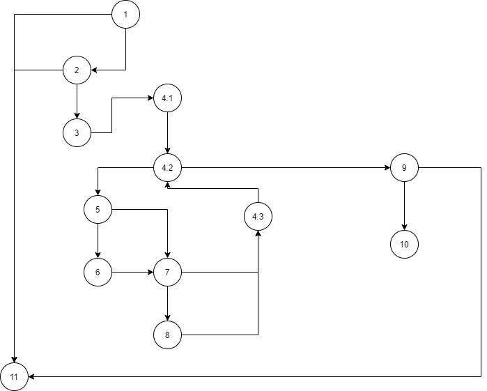

#Втора лабораториска вежба по Софтверско инженерство

##Страшо Наумов, бр. на индекс: 183050

###Група на код:
Ја добив групата на код 1

###Control Flow Graph

###Цикломатска комплексност
N=13 E=17

Цикломатската комплексност на кодот е 6. Ја добив со одземање на бројот на ребра и јазли, плус два.

Во овој случај имаме 13 јазли и 17 ребра. (17-13)+2=6.

###Тест случаи според критериумот Multiple condition
Имаме **3 if услови** со multiple conditions.

Можни случаи за првиот if:

**(user.getUsername()!=null && user.getEmail()!=null && allUsers.contains(user.getUsername()))**

|Комбинација |Можен тест случај	                |Гранка |
|------------|----------------------------------|-------|
|F && X && X |null, "em@out.com", ["u1", "u2"]	|2 -> 11|
|T && F && X |"u1", null, ["u1", "u2"]	        |2 -> 11|
|T && T && F |"u1", "em@out.com", ["u2", "u3"]	|2 -> 11|
|T && T && T |"u1", "em@out.com", ["u1", "u2"]  |2 -> 3 |

Можни случаи за вториот if:

**if (atChar && user.getEmail().charAt(i)=='.')**

|Комбинација |Можен тест случај     |Гранка  |
|------------|----------------------|--------|
|F && X      |false, "emout.com"    |7 -> 4.3|
|T && F      |true, "em@outcom"	    |7 -> 4.3|
|T && T      |true, "em@out.com     |7 -> 8  |

Можни случаи за третиот if:

**if (atChar && dotChar)**

|Комбинација |Можен тест случај     |Гранка  |
|------------|----------------------|--------|
|F && X      |false, true           |9 -> 11 |
|T && F      |true, false	        |9 -> 11 |
|T && T      |true, true            |9 -> 10 |

###Тест случаи според критериумот Every branch
|Every branch |user = null; allUsers = ["u1", "u2"]|user = {"u1", "pas1", null}; allUsers=["u2", "u3"]|user = {"u1", "pas1", ""}; allUsers=["u1", "u2"]|user = {"u1", "pas1", "em@out.com"}; allUsers=["u1", "u2"]|
|-------------|------------------------------------|--------------------------------------------------|------------------------------------------------|----------------------------------------------------------|
|1 -> 11      |*                                   |                                                  |                                                |                                                          |
|1 -> 2       |                                    |*                                                 |*                                               |*                                                         |
|2 -> 3       |                                    |                                                  |*                                               |*                                                         |
|2 -> 11      |                                    |*                                                 |                                                |                                                          |
|3 -> 4.1     |                                    |                                                  |*                                               |*                                                         |
|4.1 -> 4.2   |                                    |                                                  |*                                               |*                                                         |
|4.2 -> 5     |                                    |                                                  |                                                |*                                                         |
|4.2 -> 9     |                                    |                                                  |*                                               |*                                                         |
|5 -> 6       |                                    |                                                  |                                                |*                                                         |
|5 -> 7       |                                    |                                                  |                                                |*                                                         |
|6 -> 7       |                                    |                                                  |                                                |*                                                         |
|7 -> 8       |                                    |                                                  |                                                |*                                                         |
|7 -> 4.3     |                                    |                                                  |                                                |*                                                         |
|8 -> 4.3     |                                    |                                                  |                                                |*                                                         |
|4.3 -> 4.2   |                                    |                                                  |                                                |*                                                         |
|9 -> 10      |                                    |                                                  |                                                |*                                                         |
|9 -> 11      |                                    |                                                  |*                                               |                                                          |

###Објаснување на напишаните unit tests
**Multiple Conditions**

Во кодот имаме три if-услови, и за секој од нив напишав неколку тест случаи така што сите можни случаи да бидат опфатени.

За **првиот if**, со 4 комбинации ги опфаќам сите можни случаи, а тоа се:
* нема корисничко име
* нема маил
* има корисничко име и маил, но корисничкото име не е во листата
* има корисничко име и маил, и корисничкото име е во листата (сите услови се исполнети)

За **вториот if**, со 3 комбинации ги опфаќам сите можни случаи, а тоа се:
* неточно (false) т.е. нема „@“, и Х (Х бидејќи не е важно дали вториот услов е исполнет бидејќи првиот е грешка)
* точно (има „@“), но нема „.“(точка) во маилот
* има и „@“, и маилот е точен (има точка), и двата услови се исполнети

За **третиот if**, со 3 комбинации ги опфаќам сите можни случаи, а тоа се:
* неточно (false) бидејќи нема „@“, и true (има точка)(може второто да биде и false, нема да смени ништо бидејќи првото е false)
* точно (има „@“), но нема „.“(точка) во маилот
* има и „@“, и маилот е точен (има точка), и двата услови се исполнети

**Every branch**

Во кодот имаме 17 ребра. За да се поминат сите тие 17 ребра потребни се само 4 тест слуачи и тоа:
* објектот user да е null, со тоа автоматски функцијата враќа false
* објектот user да има корисничко име и лозинка, но маилот да е null, функцијата враќа false
* објектот user да има корисничко име, лозинка и маил, но корисничкото име да не се содржи во листата на корисници. Функцијата враќа false.
* објектот user да има корисничко име, лозинка и маил, и корисничкото име да се содржи во листата на корисници. Функцијата враќа true.